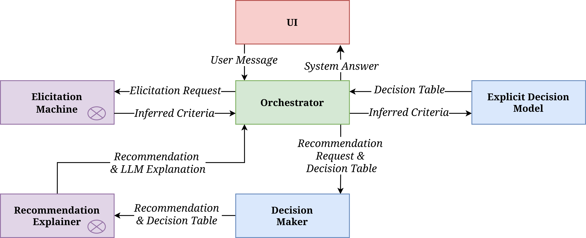

# Archssistant

Archssistant is a research prototype of an **Explainable Conversational Recommender System (CRS)** that enforces a **separation of responsibilities**: a **deterministic decision component** produces the final recommendation, while an **LLM is constrained to elicitation and natural-language explanations**.

> [!NOTE]
> This repository focuses on **traceability and auditability** of the recommendation process.

> **Tech stack**
> - **Language**: Python
> - **Web Framework**: FastAPI
> - **Local runtime**: Docker + Docker Compose
> - **Frontend**: HTML / CSS / JavaScript
> - **LLM Provider**: DeepSeek

## Table of Contents
- [Archssistant](#archssistant)
  - [Table of Contents](#table-of-contents)
  - [Need and Motivation](#need-and-motivation)
  - [Capabilities](#capabilities)
  - [Architecture Components](#architecture-components)
  - [Run Locally](#run-locally)
  - [Repository Structure](#repository-structure)
  - [Configuration](#configuration)
  - [Prompts and Traceability](#prompts-and-traceability)
  - [Logging](#logging)
    - [Changing the log level](#changing-the-log-level)

---
## Need and Motivation

LLM-based conversational recommenders commonly improve interaction quality, but they often become difficult to audit when the LLM is responsible for multiple roles (dialogue management, interpretation, and sometimes recommendation). This prototype targets that gap by isolating the **decision mechanism** into a deterministic, inspectable component while keeping the LLM limited to **interpreting user inputs**, **asking clarifying questions**, and **producing explanations grounded on the deterministic output**.

> [!CAUTION]
> This is a **research prototype**.

---
## Capabilities

| Capability                                                                 | Status |
| -------------------------------------------------------------------------- | ------ |
| **Multi-turn interaction orchestration (state machine)**                   | ✅     |
| **Deterministic recommendation (decision table / scoring / ranking)**      | ✅     |
| **Symbolic knowledge base (explicit architecture catalog)**                | ✅     |
| **LLM elicitation: interpret user answers into predefined criteria**       | ✅     |
| **LLM elicitation: ambiguity detection + clarification question generation** | ✅   |
| **LLM explanation: natural-language justification grounded on decision output** | ✅ |
| **Prompted workflow (prompt templates versioned in-repo)**                 | ✅     |
| **Structured logging (info/debug/error files)**                            | ✅     |
| **Token/context optimization (avoid re-sending long histories)**           | ❌     |
| **Evaluation metrics for explanation quality and auditability**            | ❌     |
| **Long-term conversation memory with traceable persistence (no re-sending context)** | ❌ |

> [!NOTE]
> The prototype produces explanations grounded on deterministic outputs, but it currently lacks a standardized evaluation layer to quantify explanation quality (e.g., faithfulness, completeness) and auditability (e.g., trace reconstruction accuracy).

---
## Architecture Components

- **UI (chat)**: user entry point (frontend).
- **Orchestrator**: controls the multi-turn flow (state machine).
- **Elicitation Machine (LLM)**: maps user natural language to predefined criteria and detects ambiguity (clarification).
- **Symbolic Knowledge Base**: explicit, editable knowledge used by the deterministic decision mechanism.
- **Decision Maker (deterministic)**: computes the final ranking and returns top-k recommendations.
- **Recommendation Explainer (LLM)**: generates a justification based on the deterministic decision and traced variables.

> [!CAUTION]
> The LLM must remain **non-decisional**. Any prompt or integration change that lets the LLM alter ranking undermines auditability.



> [!NOTE]
> Components marked with ⊗ are LLM-based and are restricted to elicitation and explanation (not decision making).

---
## Run Locally

From the repository root:

```bash
cp .env.example .env
# edit .env and replace DEEPSEEK_API_KEY
docker compose up --build
```

---
## Repository Structure

```text
.
├── archssistant-backend
│   ├── app
│   │   ├── api
│   │   │   ├── exceptions.py             # Custom exception classes for error handling
│   │   │   ├── __init__.py               # Package initialization
│   │   │   ├── models.py                 # Pydantic models for request/response validation
│   │   │   └── routes.py                 # HTTP endpoints and API routes
│   │   ├── core
│   │   │   ├── config.py                 # Application configuration and settings
│   │   │   ├── __init__.py               # Package initialization
│   │   │   ├── logging_config.py         # Logging setup and configuration
│   │   │   └── logging_utils.py          # Logging utility functions
│   │   ├── main.py                       # FastAPI application entry point
│   │   └── services
│   │       ├── decision_maker            # Deterministic recommendation engine
│   │       ├── elicitation_machine       # LLM-based user input interpretation
│   │       ├── orchestrator              # Multi-turn conversation flow control
│   │       ├── recommendation_explainer  # LLM-based explanation generation
│   │       └── symbolic_knowledge_base   # Architecture catalog and knowledge base
│   ├── logs                       # Application log files directory
│   ├── pyproject.toml             # Python project dependencies
│   └── uv.lock                    # Dependency lock file
├── archssistant-frontend
│   ├── index.html                 # Main HTML page
│   ├── script.js                  # Frontend JavaScript logic
│   └── style.css                  # CSS styling
└── README.md                      # Project documentation
```

---
## Configuration

The backend uses environment variables loaded from a local `.env` file.

```bash
LOG_LEVEL=DEBUG
HOST=0.0.0.0
PORT=5000
DEEPSEEK_API_KEY=sk-your-key-here
```

---
## Prompts and Traceability

Prompt templates are stored under:

* `archssistant-backend/app/services/elicitation_machine/prompt/`

These prompts are treated as **versioned behavioral artifacts** (Git history = traceability). The current prompt set enforces **strict JSON-only outputs** to keep the pipeline deterministic and auditable.

* `interpret_user_answer_prompt.txt`
  Classifies a user answer for a given parameter (e.g., `scalability`, `teamSize`) and returns:

  * `classification` (or `UNCERTAIN`)
  * `confidence` (`high|medium|low`)
  * a short `reasoning` string

* `generate_next_question_prompt.txt`
  Produces the next conversational turn. It supports:

  * **clarification mode** when `isClarificationNeeded=true`
  * **normal flow** when `isClarificationNeeded=false`
    Output is a JSON contract including `parameter_to_infer`, `question_for_user`, and `full_response_text`.

* `generate_final_descriptions_prompt.txt`
  Generates final architecture descriptions and justifications grounded on:

  * `{project_description}`
  * `{conversation_history}`
  * `{recommendations_names}`
    Output is a JSON object whose keys must match architecture names exactly.

---
## Logging

Logging is centrally configured in:

* `archssistant-backend/app/core/logging_config.py`

Logs are written under:

* `archssistant-backend/logs/`

Files:

* `info.log`  — `INFO` and `WARNING` only (records below `ERROR`)
* `error.log` — `ERROR` and `CRITICAL`
* `debug.log` — **only created when `LOG_LEVEL=DEBUG`**, includes `DEBUG` and above

Rotation policy:

* Rotating file handlers with **10 MB** max per file
* Keeps **5** backups per log file

### Changing the log level

The console verbosity is controlled by `LOG_LEVEL` (loaded from `.env`):

```bash
LOG_LEVEL=DEBUG
# or: INFO / WARNING / ERROR / CRITICAL
```

> [!NOTE]
> Recommended usage:
>
> * `DEBUG` for development and experimentation (more detail; creates `debug.log`)
> * `INFO` for normal local runs (cleaner console output)
